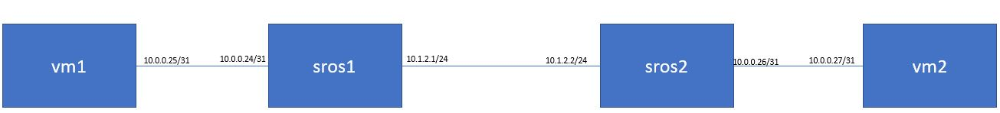
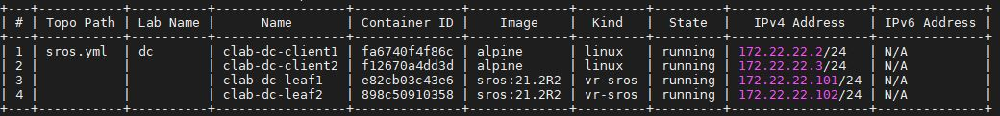

<h1>Container Lab Setup for SROS</h1>

This is to setup the lab environment for SROS, using the containerlab, as below

To install containerlab (CentOS 7)
> yum-config-manager --add-repo=https://yum.fury.io/netdevops/ && echo "gpgcheck=0" | 
> sudo tee -a /etc/yum.repos.d/yum.fury.io_netdevops_.repo  
>
> yum install containerlab

To setup the training lab environment
> cd /  
> git clone https://github.com/muzafferkahraman/sros-training-lab  
> cd sros-training-lab  
> clab dep -t sros.yml --reconfigure  

After the script runs sucessfully, a  <b>clab inspect --all </b> check should return an ouput like below

Now you must be able to ping hosts from each other  

from Client1: 
>ping 10.0.0.102

from Client2: 
>ping 10.0.0.101

You can connect to host nodes (ie host-11) 
> docker exec -ti clab-dc-client1 bash

You can connect to SROS nodes (ie leaf1) 
> ssh admin@172.22.22.101

Thanks 

