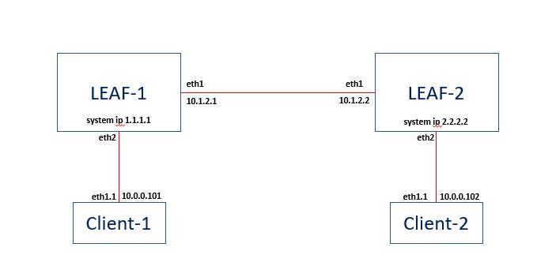

<h1>Container Lab Setup for SROS</h1>

This is to setup the lab environment for SROS, using the containerlab, as below

To install containerlab (CentOS 7)
> yum-config-manager --add-repo=https://yum.fury.io/netdevops/ && echo "gpgcheck=0" | 
> sudo tee -a /etc/yum.repos.d/yum.fury.io_netdevops_.repo  
>
> yum install containerlab

To setup the training lab environment
> cd /  
> git clone https://github.com/muzafferkahraman/sros-training-lab  
> cd sros-training-lab  
> clab dep -t sros.yml --reconfigure  

After the script runs sucessfully, a  <b>docker ps -a </b> check should return an ouput like below

Alpine Linux hosts also need to be configured  
You can do that by running 
> sh configure_hosts.sh

Now you must be able to ping hosts from each other  

from host10: 
>ping 192.168.200.15 

from host20: 
>ping 192.168.100.15 

You can connect to host nodes (ie host-11) 
> docker exec -ti clab-muzolab-host11 bash

You can connect to SRLinux nodes (ie host-11) 
> docker exec -ti clab-muzolab-spine1 sr_cli

Thanks 

